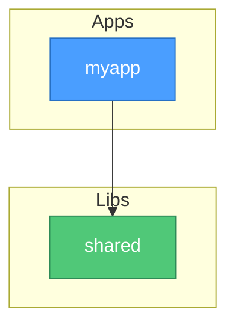

# pymono

A Python monorepo powered by [uv workspaces](https://docs.astral.sh/uv/concepts/workspaces/).

## Structure

```
pymono/
├── pyproject.toml              # Workspace root — shared config & deps
├── .python-version             # Pinned Python version (single source of truth)
├── Makefile                    # Developer command runner
├── uv.lock                    # Universal lock file
├── scripts/
│   ├── check_deps.py           # Workspace convention linter (11 checks)
│   ├── check_lock.sh           # Lock file drift detector
│   ├── dep_graph.py            # Dependency graph generator (Mermaid)
│   └── affected.py             # Selective build change detection
├── docs/
│   └── dependency-graph.md     # Auto-generated dependency graph
├── libs/                       # Shared libraries
│   └── shared/
└── apps/                       # Deployable applications
    └── myapp/
```

## Quick Start

```bash
# Install everything (including workspace packages)
make install

# Run an app
uv run --package myapp myapp

# Run ALL checks (guardrails + lint + typecheck + test)
make check

# Individual targets
make lint          # ruff + format + import boundaries
make typecheck     # ty type checker
make test          # pytest with coverage
make graph         # generate dependency graph
make format        # auto-format code
make clean         # remove caches and artifacts

# Selective builds (only affected packages)
make lint SCOPE=auto
make typecheck SCOPE=auto
make test SCOPE=auto
make check SCOPE=auto

# Explicit package scope
make test SCOPE="libs/shared apps/myapp"
```

## Adding Packages

```bash
# New library
make new-lib name=mylib

# New application
make new-app name=newapp
```

Then add workspace dependencies in the member's `pyproject.toml`:

```toml
dependencies = ["shared"]

[tool.uv.sources]
shared = { workspace = true }
```

> [!IMPORTANT]
> After adding a new package, update `extra-paths` in `[tool.ty.environment]` and
> `root_packages` / import-linter contracts in the root `pyproject.toml`.

## Dependency Management

**All third-party dependencies are centralized in the root `pyproject.toml`.**

Members may only depend on other workspace members. External packages go in root `[dependency-groups]`:

```toml
# root pyproject.toml
[dependency-groups]
dev = ["ruff", "pytest", "pytest-cov", "import-linter", "ty", "pre-commit"]
data = ["pandas", "numpy"]       # add groups as needed
```

## Guardrails

### Structural Lint (`scripts/check_deps.py`)

| Check | Rule |
|---|---|
| External deps | Members can't declare third-party dependencies |
| Python version files | No member-level `.python-version` — root only |
| `requires-python` | Must match root |
| Circular deps | No A → B → A cycles between workspace members |
| Build backend | All members must use `uv_build` |
| Dependency direction | Apps can depend on libs only; libs can never depend on apps |
| Root sources | No `[tool.uv.sources]` in root `pyproject.toml` |
| Tool overrides | No `[tool.ruff]` or `[tool.pytest]` in members |
| Optional deps | No `[project.optional-dependencies]` in members |
| Naming | Package name must match its directory name |

### Import Boundaries (`import-linter`)

- **Apps are independent** — no app may import from another app
- **Libs can't import apps** — dependency flows one direction only

### Type Checking (`ty`)

Astral's [ty](https://docs.astral.sh/ty/) type checker runs against all workspace code, configured in the root `pyproject.toml` with cross-package `extra-paths`.

### Test Coverage (`pytest-cov`)

Tests run with `--cov --cov-report=term-missing` by default. Coverage output shows per-file line coverage.

### Lock File Drift (`scripts/check_lock.sh`)

Ensures `uv.lock` is in sync with all `pyproject.toml` files.

## Pre-commit Hooks

```bash
# Install hooks (one-time)
uv run pre-commit install
```

Hooks run automatically on `git commit`:
- **ruff** — lint with auto-fix
- **ruff-format** — code formatting
- **check-workspace** — structural convention checks
- **check-lock** — lock file drift

## CI

The GitHub Actions workflow (`.github/workflows/ci.yml`) runs five jobs:

| Job | Scope | Description |
|---|---|---|
| **detect** | Always | Determines which packages are affected |
| **guardrails** | Always full | Workspace conventions + lock drift |
| **lint** | Selective | ruff + format + import-linter |
| **typecheck** | Selective | ty type checker |
| **test** | Selective | pytest with coverage |

### Selective Builds

The `detect` job runs `scripts/affected.py` to identify changed packages and their transitive dependents. Downstream jobs (lint, typecheck, test) only run on affected paths. Infrastructure changes (`pyproject.toml`, `scripts/`, etc.) automatically escalate to full runs. Pushes to `main` always run everything.

### CI Tamper Protection

On PRs, CI **pins guardrail files from `main`** before running checks:

```yaml
- name: Pin guardrails from main
  if: github.event_name == 'pull_request'
  run: |
    git checkout origin/main -- scripts/ pyproject.toml .python-version
```

## Dependency Graph

Generate with `make graph`. The output is a Mermaid diagram written to `docs/dependency-graph.md`:


