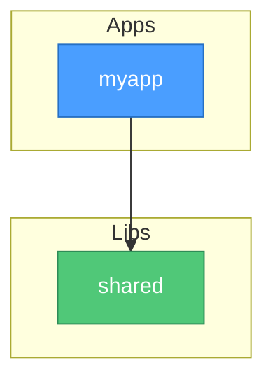

# Dependency Graph

```mermaid
graph TD
    subgraph Apps
        myapp[myapp]:::app
    end
    subgraph Libs
        shared[shared]:::lib
    end
    myapp --> shared

    classDef app fill:#4a9eff,stroke:#2670c4,color:#fff
    classDef lib fill:#50c878,stroke:#2e8b57,color:#fff
```
